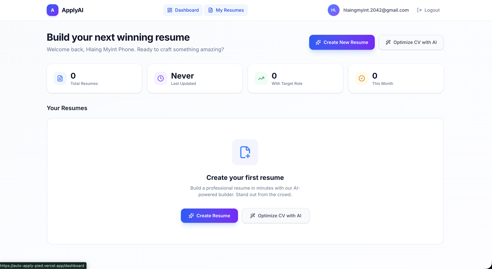
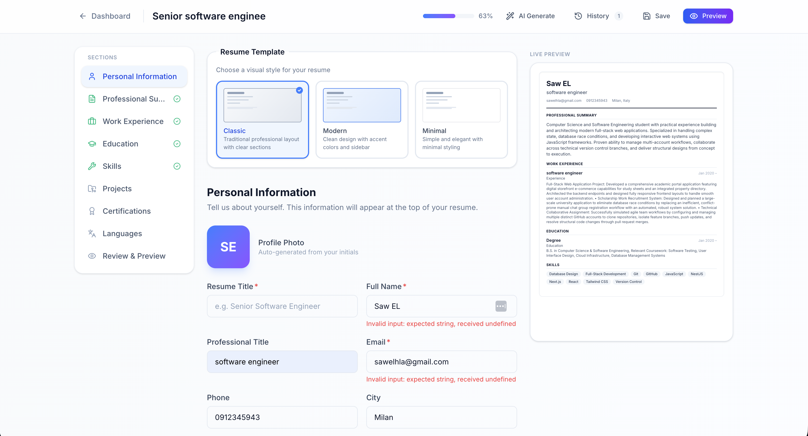
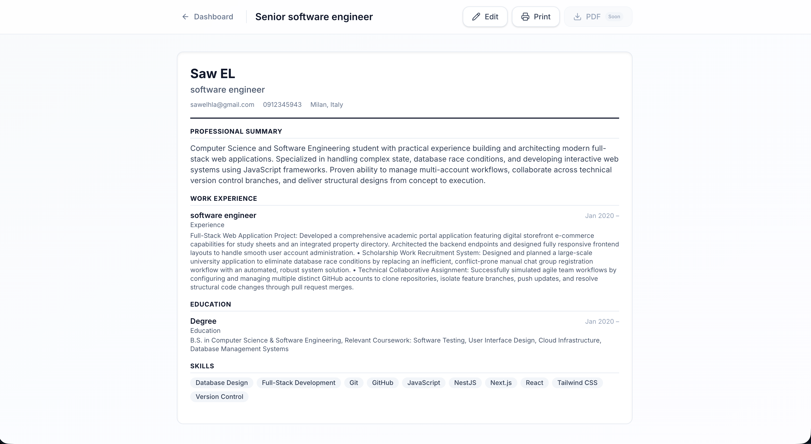
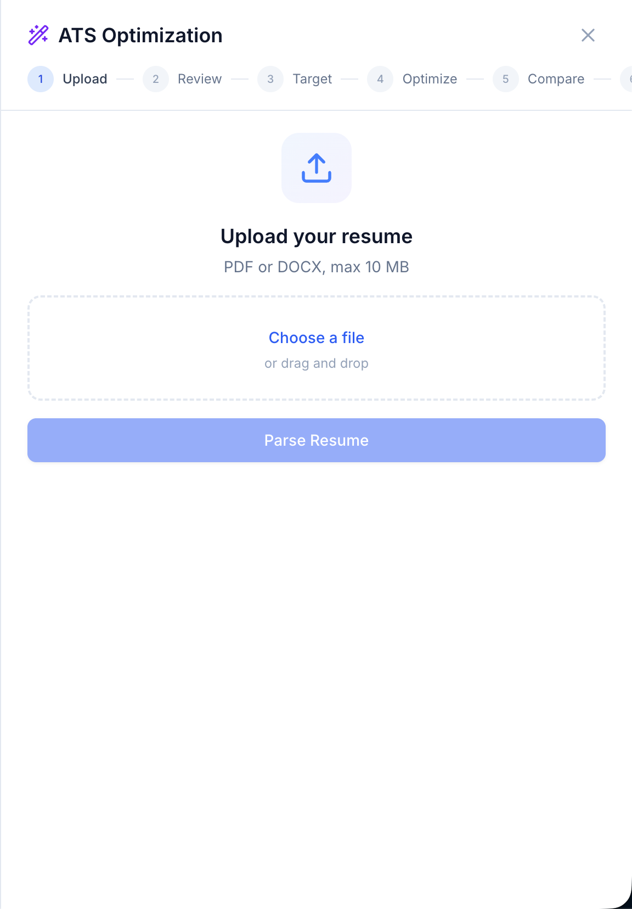
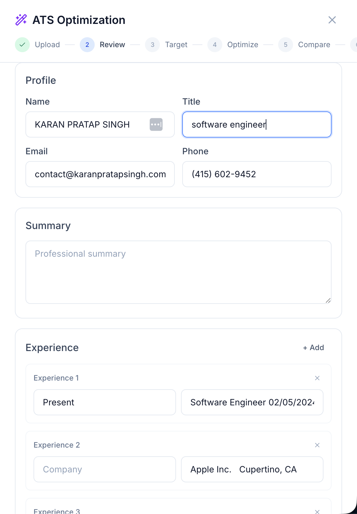
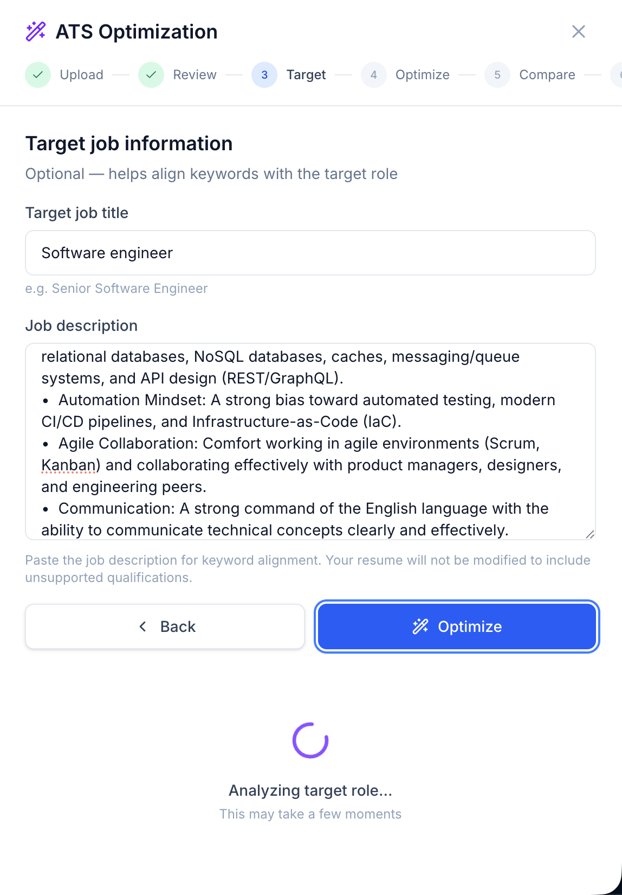

# ApplyAI

> Build, refine, and manage professional resumes from one focused workspace.

[](https://nextjs.org/)
[](https://react.dev/)
[](https://www.typescriptlang.org/)
[](https://supabase.com/)

ApplyAI is a full-stack resume builder that helps job seekers organize their career information, create role-specific resumes, preview changes in real time, and preserve previous versions. It combines a responsive editing experience with Supabase-backed authentication, persistence, and file storage.

[View the live application](https://auto-apply-pied.vercel.app/)

## Product preview

### Resume dashboard

Manage resumes, monitor recent activity, and start a new resume from a single dashboard.



### Guided builder with live preview

Edit each resume section, choose a visual template, generate content, and see the result update alongside the form.



### Print-ready resume preview

Review the finished document in a distraction-free layout before printing or returning to the editor.



### ATS optimization workflow

The guided optimization experience takes an existing PDF or DOCX resume through review and target-role alignment.

<table>
  <tr>
    <td align="center"><strong>1. Upload</strong></td>
    <td align="center"><strong>2. Review</strong></td>
    <td align="center"><strong>3. Target</strong></td>
  </tr>
  <tr>
    <td></td>
    <td></td>
    <td></td>
  </tr>
</table>

## Features

- Email/password and Google authentication
- Central dashboard for resume management and activity statistics
- Section-based editor for profile, summary, experience, education, skills, projects, certifications, and languages
- Three resume templates with a real-time document preview
- AI-assisted resume generation through a provider-based architecture
- Version history with preview and restore support
- Resume file upload and management through Supabase Storage
- Print-friendly final preview
- Schema validation and typed server-side operations
- Responsive, accessible interface for desktop and mobile workflows

> [!NOTE]
> The repository currently includes a deterministic mock AI provider for local development and testing. A production model provider can be added behind the existing provider interface.

## Tech stack

| Layer | Technology | Purpose |
| --- | --- | --- |
| Application | Next.js 16 App Router | Server rendering, routing, and server actions |
| Interface | React 19, Tailwind CSS 4, Lucide React | Component UI, responsive styling, and icons |
| Language | TypeScript 5 | End-to-end static typing |
| Backend | Supabase, PostgreSQL | Authentication, relational data, and file storage |
| Validation | Zod 4 | Runtime validation for forms and operations |
| Testing | Vitest, Testing Library, jsdom | Unit and component tests |
| Tooling | ESLint 9, npm | Code quality and package management |
| Delivery | Vercel, Docker Compose | Production hosting and optional containerized development |

## Getting started

### Prerequisites

- Git
- Node.js 20 or newer
- npm
- Docker Desktop or another Docker-compatible runtime for the local Supabase stack

### 1. Clone and install

```bash
git clone <repository-url>
cd resume_AI
npm ci
```

### 2. Configure the environment

```bash
cp .env.example .env
```

Start the local Supabase services:

```bash
npx supabase start
```

Add the URL and publishable key printed by the CLI to `.env`:

```dotenv
NEXT_PUBLIC_SUPABASE_URL=http://127.0.0.1:54321
NEXT_PUBLIC_SUPABASE_PUBLISHABLE_KEY=<your-publishable-key>
APP_URL=http://localhost:3000
```

### 3. Run the application

```bash
npm run dev
```

Open [http://localhost:3000](http://localhost:3000).

## Docker development

Supabase still runs on the host; Docker Compose runs the Next.js development server and connects it to Supabase through `host.docker.internal`.

```bash
npm ci
npx supabase start
npm run docker:dev
```

| Runtime | `NEXT_PUBLIC_SUPABASE_URL` |
| --- | --- |
| Host development | `http://127.0.0.1:54321` |
| Docker container | `http://host.docker.internal:54321` |

## Available scripts

| Command | Description |
| --- | --- |
| `npm run dev` | Start the Next.js development server |
| `npm run build` | Create a production build |
| `npm run start` | Run the production server |
| `npm run lint` | Check the codebase with ESLint |
| `npm run typecheck` | Run TypeScript without emitting files |
| `npm test` | Run the Vitest test suite once |
| `npm run docker:dev` | Build and start the development container |

## Project structure

```text
src/
├── app/          # App Router pages, route handlers, and server actions
├── components/   # UI, dashboard, builder, preview, and auth components
├── features/     # Domain operations and data mapping
├── hooks/        # Shared React hooks
├── lib/          # Supabase, AI, templates, validation, and utilities
└── types/        # Shared TypeScript types
supabase/
├── migrations/   # Database migrations
├── seed.sql      # Local development seed data
└── config.toml   # Local Supabase configuration
screenshots/      # Product images used in this README
```

## Deployment

The application is designed for Vercel deployment. Configure the same public Supabase variables in the Vercel project and set `APP_URL` and `ALLOWED_ORIGINS` to the production domain. Docker Compose is intended for local development only.

## License

No license has been specified for this repository.
